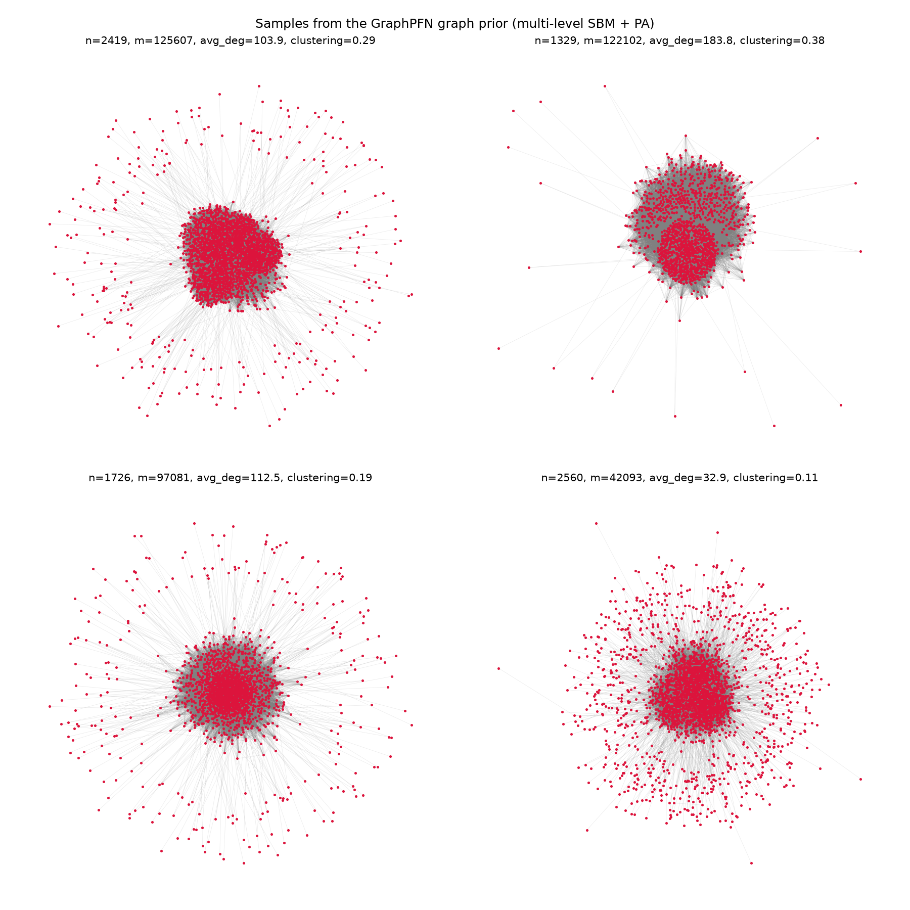
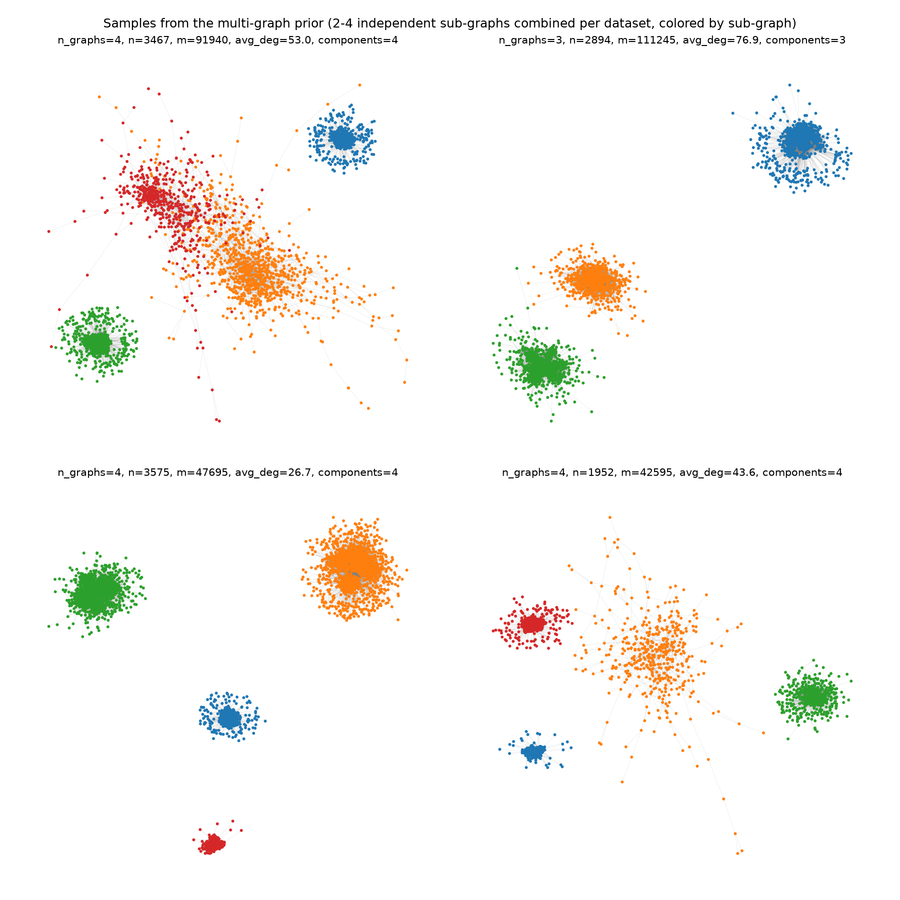
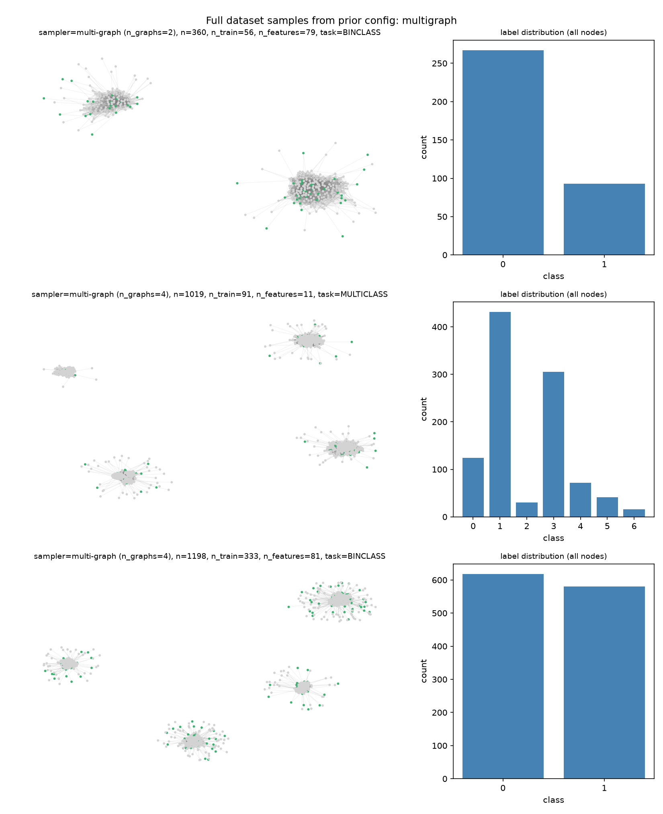
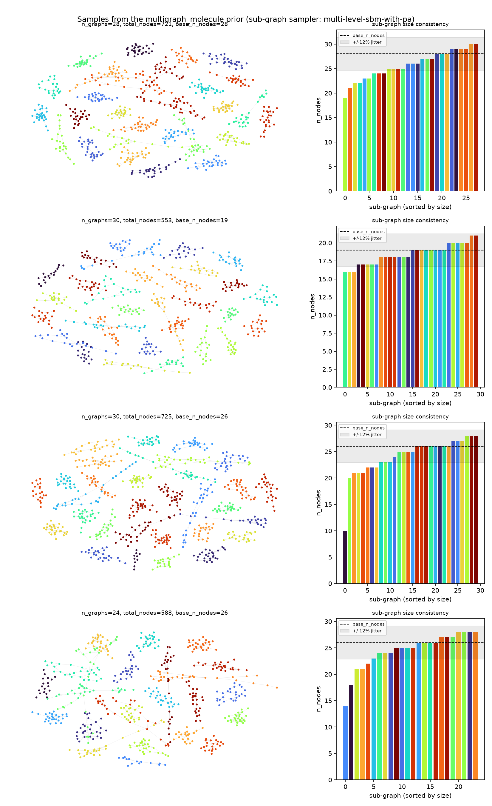
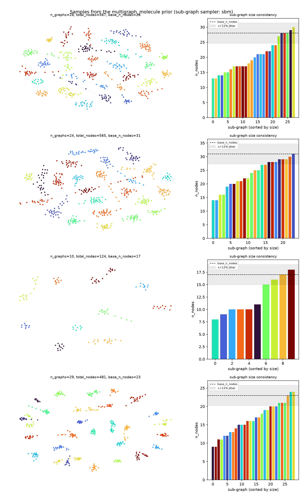
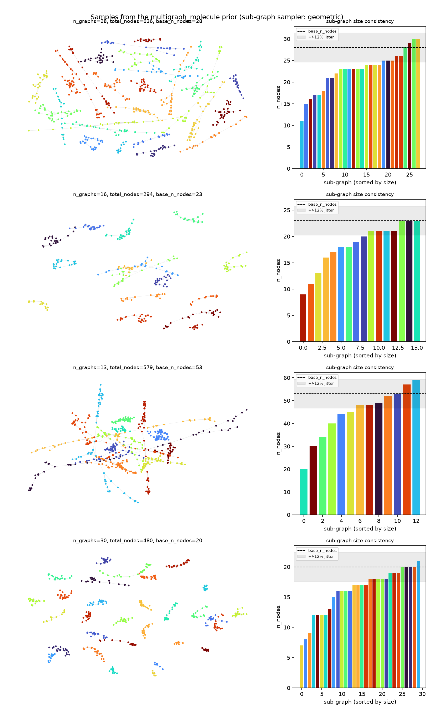
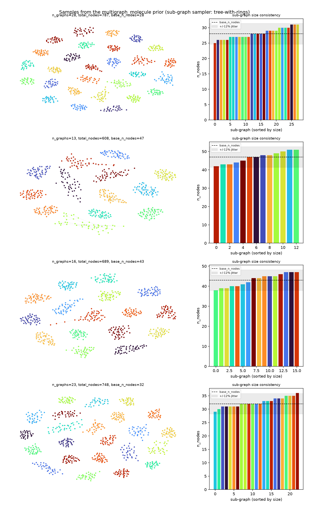
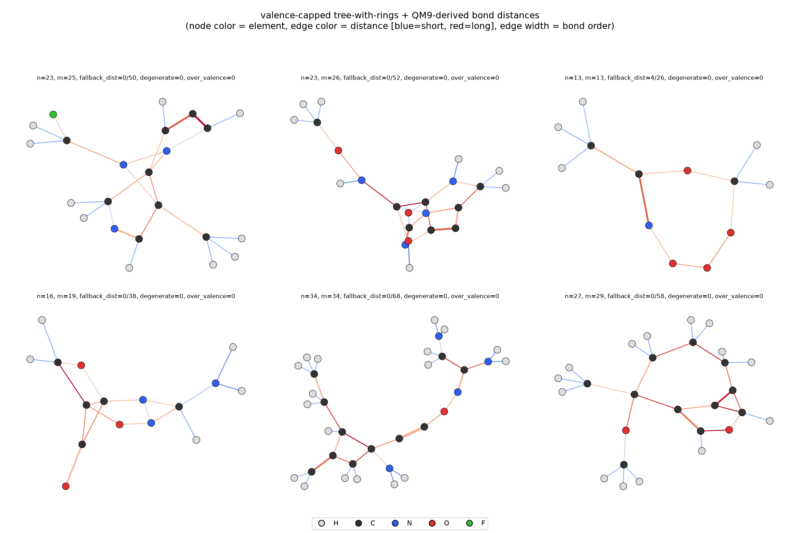
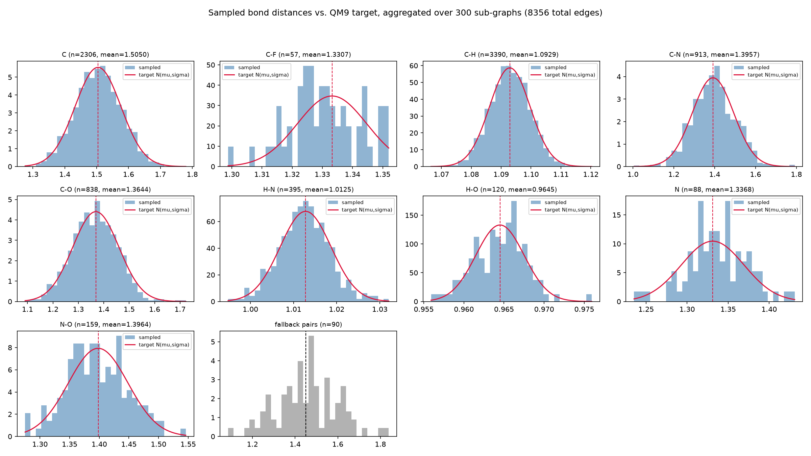
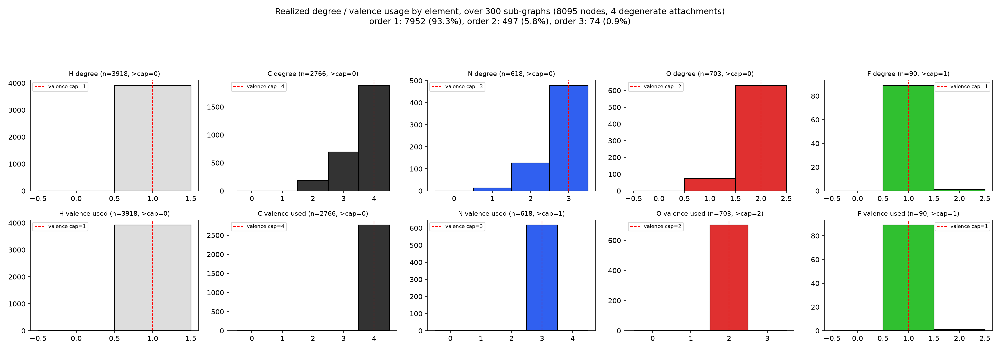

# Multi-Graph Priors for GraphPFN Pretraining

This documents the exploratory work in this session: changing GraphPFN's
pretraining prior from sampling **one large graph per synthetic dataset** to
sampling **several smaller graphs combined into one dataset**, and pushing
that idea toward resembling real organic-molecule datasets.

Everything here is additive — the original single-graph prior and its
pretraining config (`exp/graphpfn/pretrain/main/`) are untouched and behave
exactly as before.

## 1. Baseline: the original single-graph prior

As background, we first sampled and visualized what the paper's original
prior actually produces: one graph per dataset (1000-5000 nodes), generated
by a multi-level stochastic block model with preferential attachment
(multi-level-sbm-with-pa) — designed to resemble social/information
networks, with dense community "blocks" and a preferential-attachment
periphery.

`sample_prior_graph.py` samples and plots this directly:

## 2. Multi-graph prior: combining several graphs into one dataset

The core idea: instead of one big graph per training step, sample `n_graphs`
independent smaller graphs and combine them via disjoint union (so the
adjacency is block-diagonal — no edges between them). Since the graph
adapters' message passing / attention only ever look at 1-hop neighbors,
this required no changes to the model, attribute generation, or training
loop at all — only to how the graph *structure* is sampled.

The total node budget was kept proportional to the original single-graph
setup (scaled down by the mean number of graphs), so per-step compute stays
comparable.

`sample_multi_graph_prior.py` visualizes the raw structure (sub-graphs
colored by which graph they belong to):

`visualize_prior_sample.py` goes further and samples a *full* dataset
(features, labels, train/test split) through the exact same pipeline used
during training, for any config by name — showing what the model actually
sees, not just the structure:

This config is trained with `run.sh`, and logs loss/synthetic-score to a
`training_log.jsonl` file per training step.

**On anticipated effects:** before running this, we discussed the expected
impact of combining more, smaller graphs per dataset instead of one large
graph — namely, that it dilutes both the graph structure's local
neighborhood richness and the number of labeled ("train") nodes available
per sub-graph, which should make the task harder and likely show up as a
higher loss/lower synthetic-score plateau than the single-graph baseline,
even though the *training mechanics* are unaffected.

## 3. Resembling organic-molecule datasets

A natural real-world analogue for "many graphs per dataset" is a molecular
dataset: many separate molecules (graphs), each with relatively few atoms,
where molecules *within one dataset* tend to be similar in size to each
other (unlike the first multi-graph prior above, where each sub-graph's size
was drawn totally independently).

To capture that, sub-graph sizing was changed to two levels of randomness:
- `base_n_nodes`: one shared "typical size" for the whole dataset, resolved
  once per dataset (not per sub-graph) — think of it as that dataset's
  characteristic molecule size.
- each sub-graph's actual size is then `base_n_nodes` jittered by only a
  small relative amount, so sub-graphs in one dataset stay close in size to
  each other.

Combined with many more (10-30), smaller (15-60 node), sparser sub-graphs
per dataset, `visualize_molecule_prior.py` shows both the graph layout and a
size-consistency panel (each sub-graph's size against the shared target ±
jitter band):

This variant is trained with `run_molecule.sh`.

## 4. Does the structural generator itself matter?

The multi-level-sbm-with-pa generator above is purpose-built to resemble
*social networks* — dense community blocks plus a preferential-attachment
periphery, only *probabilistically* connected. That's a poor structural
match for real molecules, which are connected by construction, close to
trees, and degree-bounded by valence rather than having power-law "hub"
atoms.

To check this empirically, `visualize_molecule_prior.py` supports swapping
the sub-graph generator while holding everything else (graph count, target
size, jitter, density) fixed, for a controlled, apples-to-apples comparison:

**Plain SBM** (no hierarchy, no preferential attachment):

**Random geometric graph** (nodes as points in latent space, edges between
nearby points — a different generative family entirely):

Both alternatives turned out to match the "consistent size within a
dataset" goal noticeably worse than multi-level-sbm-with-pa, since sparser,
smaller graphs from either generator disconnect more easily and lose more
nodes to trimming.

## 5. A purpose-built molecule-like generator: tree + ring closure

Since none of the existing generators were designed with molecular topology
in mind, we implemented a new one: a degree-capped random tree (connected
*by construction* — no trimming needed at all) plus a small number of
ring-closing edges between nodes that are already close to each other in the
tree, so ring sizes stay realistic. This directly encodes the two defining
structural properties of organic molecules: guaranteed connectivity and
valence-bounded degree.

This produced by far the tightest size consistency of any generator tried —
every sample's sub-graph sizes landed at or near the target band, with no
outliers. This variant is trained with `run_molecule_tree.sh`.

## 6. Adding geometry: valence, bond order, and QM9 bond distances

Section 5's tree-with-rings generator gives valid, molecule-like *topology*,
but topology alone can't distinguish molecules that share a local shape: CH2
and CO2 are both a degree-2 star, but their bond lengths differ. The next
step, prototyped standalone in `sample_geometric_molecule_prior.py` (does
not touch the training pipeline — pure sampling + visualization, like the
other `dev/*.py` scripts), was to layer atom identity and 3D bond distance on
top, targeting distance first and deliberately deferring bond angles/3D
placement.

This went through three iterations, each caught by actually sampling and
looking at the output rather than reasoning about it in the abstract:

1. **Atom types sampled independently of topology.** Draw an element per
   node (weighted toward QM9's composition: H > C > O > N > F) *after* the
   degree-capped tree was already built, then sample each edge's distance
   from a per-element-pair Gaussian fit to QM9 bond-length statistics.
   Distances matched the QM9 targets closely (validated by aggregating
   thousands of sampled edges against the target `N(mu, sigma)`), but the
   topology was chemically inconsistent — since degree was capped by one
   global `max_degree=4` regardless of which atom ended up on a node, a
   degree-4 nitrogen (valence 3) with 3 hydrogens already attached could
   still pick up a 4th bond.

2. **Per-node valence caps + bond order.** The real fix: sample the element
   *first*, derive a valence budget from it (H/F=1, O=2, N=3, C=4), and grow
   the tree/rings so each new edge consumes a sampled *bond order* (1/2/3,
   weighted toward single bonds) worth of valence from both endpoints — not
   just 1. This is what makes valence, not degree, the capped quantity: a
   C#C triple bond consumes 3 of carbon's 4 valence units through a single
   edge (degree contribution 1), leaving exactly 1 unit for one more bond —
   giving that carbon degree 2 overall, matching acetylene H-C#C-H. Bonds
   touching H/F are automatically forced to order 1, with no special-casing,
   since remaining valence for those atoms never exceeds 1.

   This mostly worked, but elements were still drawn independently and
   competed uniformly at random for attachment slots during tree growth.
   Since H alone is ~52% of atoms and saturates instantly (valence 1), the
   pool of nodes with spare capacity emptied out fast as the tree grew,
   forcing a "degenerate" fallback (attach anyway, exceeding valence) on
   about 10% of attachments — visible directly in a diagnostic panel
   aggregating realized valence usage per element against each element's
   cap across hundreds of sampled sub-graphs.

3. **Skeleton first, hydrogens after.** Remove the competition entirely:
   sample only the heavy atoms (C/N/O/F) and grow the valence-capped
   tree/rings *among those*, then walk the finished skeleton and attach one
   explicit hydrogen leaf per unit of *leftover* valence on each heavy atom.
   H can now only ever be added, never compete for a slot, so valence
   violations for H become structurally impossible, and the heavy-only
   valence distribution (mean ~3.3) is far less skewed than the mixed one
   (mean ~1.8), making the growth-phase fallback rare too. This dropped
   degenerate attachments from ~10% to ~0.05% of all nodes, confirmed by
   re-running the same valence-usage diagnostic.

   One more calibration was needed here: the sub-graph template's
   `avg_degree` (3.0-6.0) had been tuned for the old semantics where most
   nodes were degree-1 hydrogens dragging the average down. Applied directly
   to the heavy-only skeleton, it asked for 3-6 heavy-heavy bonds per heavy
   atom — far denser than real small organic molecules — which consumed
   nearly all valence in heavy-heavy ring bonds and starved hydrogen
   generation (skeletons came out as dense fused meshes with almost no H).
   Giving the heavy skeleton its own, lower avg-degree range (1.8-2.6,
   closer to real heavy-atom-only connectivity) fixed this.

Bond *distance* is still sampled per edge from the per-element-pair QM9
prior below (mean, std in Angstrom), with a generic fallback
(`N(1.45, 0.15)`) for element pairs QM9 doesn't cover here (e.g. H-H, F-F,
F-N, F-O, O-O) — and does not yet depend on the sampled bond order (a C=C
and a C-C currently draw from the same C-C prior). That's the natural next
refinement, deferred so this step could focus on getting the valence
bookkeeping right first.

| Bond | Mean (Å) | Std (Å) |
|---|---:|---:|
| C-C | 1.5042 | 0.0719 |
| C-F | 1.3332 | 0.0115 |
| C-H | 1.0929 | 0.0068 |
| C-N | 1.3918 | 0.1011 |
| C-O | 1.3689 | 0.0906 |
| H-N | 1.0128 | 0.0059 |
| H-O | 0.9645 | 0.0030 |
| N-N | 1.3311 | 0.0382 |
| N-O | 1.3982 | 0.0503 |

Final result — node color = element, edge color = sampled distance
(blue=short, red=long), edge width = sampled bond order:

Distance-validation panel — sampled distances aggregated per element pair
across 300 sub-graphs, overlaid on the target QM9 `N(mu, sigma)`:

Valence-validation panel — realized degree and realized valence usage per
element, aggregated across 300 sub-graphs, checked against each element's
valence cap (should never exceed the red dashed line):

**Status:** validated in isolation only — this is still a `dev/` sandbox
script, not wired into the training pipeline. Getting it into
`GraphPFN`/`PriorDataset`/the graph adapters would require (a) preserving
per-edge distance through `to_simple`/`extract_largest_component`/
`shuffle_nodes`, which currently rebuild the graph from bare `(src, dst)`
tensors and drop any node/edge data; (b) a new `edge_distances` field on
`PriorDataset`/`PriorDatasetBatch`; and (c) a distance-bias term in
`GraphPFNGraphAttentionModule`'s attention scores (currently pure QK
dot-product attention with zero use of edge data). Not attempted yet.

## Summary of experiment configs

| Config | Sub-graphs / dataset | Sub-graph size | Structural generator | Launch script |
|---|---|---|---|---|
| `main` | 1 | 1000-5000 | multi-level-sbm-with-pa | (original, unmodified) |
| `multigraph` | 2-4 | 84-1667, independent per sub-graph | multi-level-sbm-with-pa | `run.sh` |
| `multigraph_molecule` | 10-30 | 15-60, shared target ± small jitter | multi-level-sbm-with-pa | `run_molecule.sh` |
| `multigraph_molecule_tree` | 10-30 | 15-60, shared target ± small jitter | tree-with-rings | `run_molecule_tree.sh` |

## Where things live

- **Prior sampling code:** `lib/graphpfn/prior/graphs/` — `multi_graph.py`
  (combining sub-graphs into one dataset) and `tree_with_rings.py` (the new
  molecule-like generator) are the two new building blocks; everything else
  in that directory is the paper's original code, unmodified.
- **Training configs:** `exp/graphpfn/pretrain/<name>/pretrain.toml`
- **Visualization scripts:** `dev/*.py` (this directory) — each is
  self-contained and safe to run anytime (CPU-only, no GPU/model involved),
  independent of any training job that happens to be running.
- **Geometry prototype:** `dev/sample_geometric_molecule_prior.py` (section
  6) — valence/bond-order-capped skeleton-then-hydrogens generation plus
  QM9-derived bond distances. Standalone; not called by anything in `lib/`.
